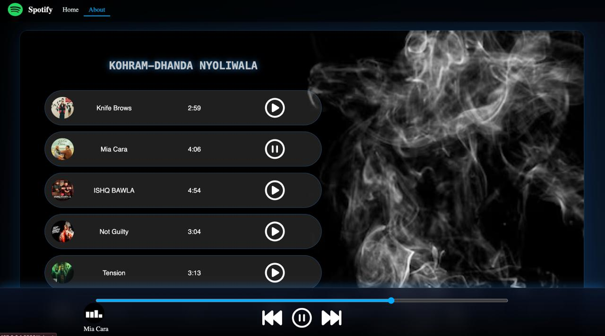
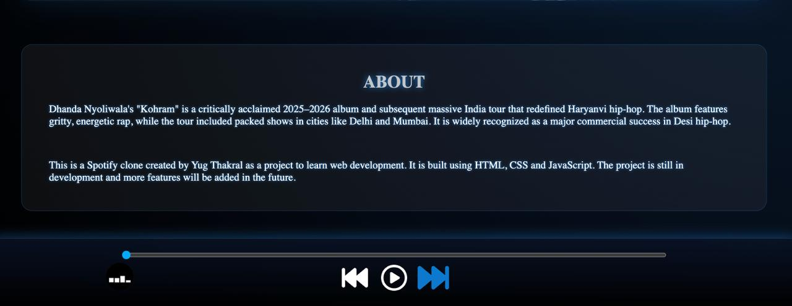

# 🎧 Spotify Clone (Web Music Player)

A modern **Spotify-inspired music player** built using **HTML, CSS, and JavaScript**.  
This project focuses on clean UI design, smooth interactions, and core music player functionality.

---

## 📸 Preview

  
  

---

## 🚀 Features

- 🎵 Play / Pause songs  
- ⏭ Next / Previous track  
- 📊 Interactive progress bar  
- 🎶 Click any song to play  
- ✨ Smooth hover effects  
- 💡 Glowing modern UI design  
- 👤 Custom hover profile card (JavaScript)  
- 🔁 Auto play next song  

---

## 🛠️ Tech Stack

- **HTML5**
- **CSS3** (Flexbox, Animations, Glow Effects)
- **JavaScript** (DOM Manipulation + Audio API)

---

## 📂 Project Structure

Spotify-Clone/
│── songs/
│── image1.jpeg
│── image2.jpeg
│── gif.png
│── index.html
│── style.css
│── script.js

## 💡 About the Project

This Spotify clone was created by Yug Thakral as a project to learn web development.
It demonstrates how to build an interactive UI and handle audio using JavaScript.

This is just the beginning — I’ll build even better and more advanced projects in the future 🚀

## 👨‍💻 Contributor

**Yug Thakral**

---

## 🤝 Connect With Me

  

